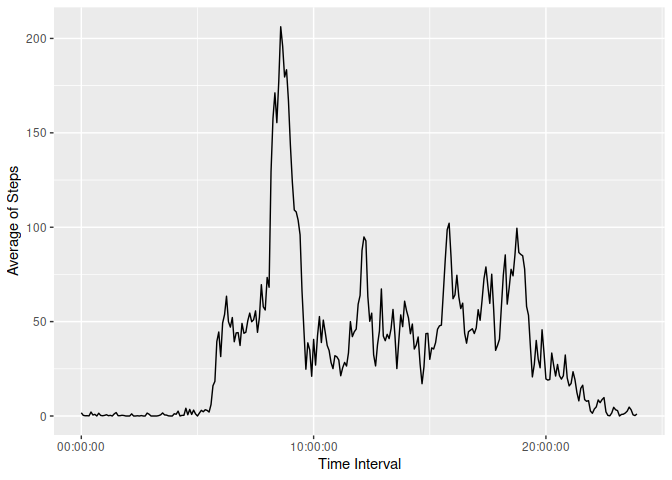
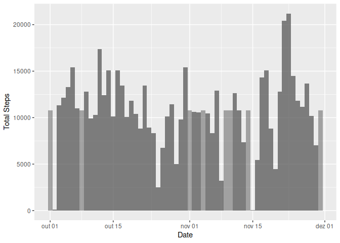
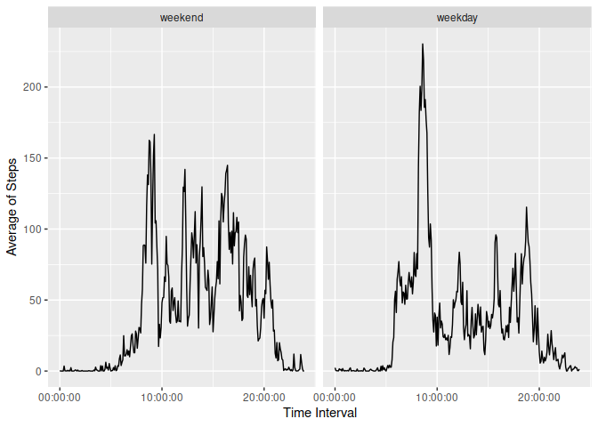

## Loading and preprocessing the data

The data is decompressed and stored in a variable called "activity_data".

```r
unzip("activity.zip")
activity_data <- read.csv("activity.csv")
```

For easier handling, let's use a tibble data frame and format the date and
interval variables.

```r
library(tidyverse)
activity_data <- tibble(activity_data)

parse_to_time <- function(x) {parse_time(str_pad(x, 4, pad = "0"), "%H%M")}

activity_data <- mutate(activity_data, date = as.Date(date),
                                       interval = parse_to_time(interval))
```

## What is mean total number of steps taken per day?

How many steps are taken by day, disregarding not measured intervals?

```r
steps_per_day <- activity_data %>%
                 group_by(date) %>%
                 summarise(total_steps = sum(steps, na.rm = TRUE))
```

Display this data as a histogram.

```r
ggplot(steps_per_day) + 
  geom_bar(mapping = aes(x = date, y = total_steps), 
           width=1,
           stat="identity") +
  ylab("Total Steps") +
  xlab("Date")
```

<!-- -->

Now, let's make a summary of these measures

```r
summary(steps_per_day$total_steps)
```

```
##    Min. 1st Qu.  Median    Mean 3rd Qu.    Max. 
##       0    6778   10395    9354   12811   21194
```


## What is the average daily activity pattern?

How many steps are taken in average by interval?

```r
steps_per_interval <- activity_data %>%
                      group_by(interval) %>%
                      summarise(mean_of_steps = mean(steps, na.rm = TRUE))
```

Display this data as a time series plot.

```r
ggplot(steps_per_interval) +
  geom_line(mapping = aes(x = interval, y = mean_of_steps)) +
  xlab("Time Interval") + ylab("Average of Steps")
```

<!-- -->

Let's calculate which interval has the greatest number of steps in average.

```r
with(steps_per_interval, interval[which.max(mean_of_steps)])
```

```
## 08:35:00
```

## Imputing missing values

How many values is the dataset missing?

```r
sum(is.na(activity_data$steps))
```

```
## [1] 2304
```

To proceed with the analysis, let's fill these missing values with the mean of
steps in each interval so the pattern plotted above still holds.

```r
nas <- is.na(activity_data$steps)
fill_values <- lapply(activity_data$interval[nas], 
                      function(x) {with(steps_per_interval,
                                        mean_of_steps[which(interval == x)])})

filled_activity_data <- tibble(activity_data)
filled_activity_data$steps[nas] <- sapply(fill_values, round)
```


Plotting the new data set for the total count of steps by day over the one made
before:

```r
filled_steps_per_day <- filled_activity_data %>%
                        group_by(date) %>%
                        summarise(total_steps = sum(steps))

ggplot(filled_steps_per_day) + 
  geom_bar(mapping = aes(x = date, y = total_steps),
           stat = "identity",
           alpha = 0.5,
           width = 1) +
  geom_bar(mapping = aes(x = date, y = total_steps),
           stat = "identity",
           data = steps_per_day,
           alpha = 0.5,
           width = 1) +
  ylab("Total Steps") + xlab("Date")
```

<!-- -->

Imputing the average steps per interval where there were missing values made
the data set more cohesive and easier to handle.

Here is a comparison of summaries before and after imputing:

```r
summary(steps_per_day$total_steps)
```

```
##    Min. 1st Qu.  Median    Mean 3rd Qu.    Max. 
##       0    6778   10395    9354   12811   21194
```

```r
summary(filled_steps_per_day$total_steps)
```

```
##    Min. 1st Qu.  Median    Mean 3rd Qu.    Max. 
##      41    9819   10762   10766   12811   21194
```

## Are there differences in activity patterns between weekdays and weekends?

To create a factor variable useful for this comparison, let's do:

```r
filled_activity_data <- filled_activity_data %>%
  mutate(day_of_week = case_when(
    lubridate::wday(date) == 7 | lubridate::wday(date) == 1 ~ "weekend",
    any(rep(lubridate::wday(date), 5) == c(2, 3, 4, 5, 6)) ~ "weekday"),
         day_of_week = factor(day_of_week, levels = c("weekend", "weekday"))
  )
```

Plotting the comparison:

```r
weekday_comparison <- filled_activity_data %>%
                      group_by(day_of_week, interval) %>%
                      summarise(mean_of_steps = mean(steps))

ggplot(weekday_comparison) +
  geom_line(mapping = aes(x = interval, y = mean_of_steps)) +
  xlab("Time Interval") + ylab("Average of Steps") +
  facet_wrap(~ day_of_week)
```

<!-- -->
